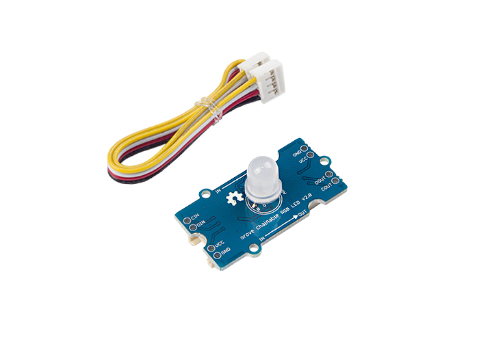
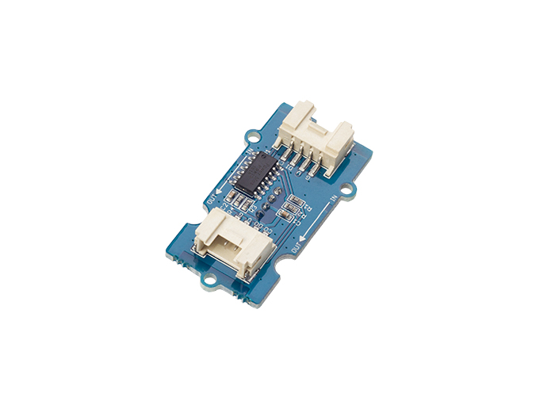

Grove chainable RGB LED
============

More info see :[seeed studio wiki](http://wiki.seeedstudio.com/Grove-Chainable_RGB_LED/)

## Examples

Send `RGB_LED.py` to board by `MaixPy IDE` or `upyloader` first, or just merge `RGB_LED.py` and example file to one file

* [breath](breath.py)
* [fade_inout](fade_inout.py)

