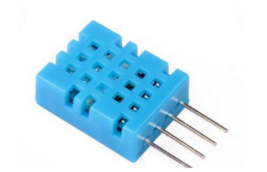

# DHT11 温湿度传感器示例



DHT11是一款有已校准数字信号输出的温湿度传感器。 其精度湿度+-5%RH， 温度+-2℃，量程湿度20-90%RH， 温度0~50℃。

模块详细信息参考数据手册: [dht11_data_sheet](DHT11-Technical-Data-Sheet.pdf)

## 示例使用

该示例使用 MaixPy 实现， 只需要修改下面参数即可运行， 终端将不断打印读取到的温湿度数据。

```python
# initialize GPIOHS3 using io 7
fm.register(7, fm.fpioa.GPIOHS3, force=True)
gpio = GPIO(GPIO.GPIOHS3, GPIO.OUT)
```