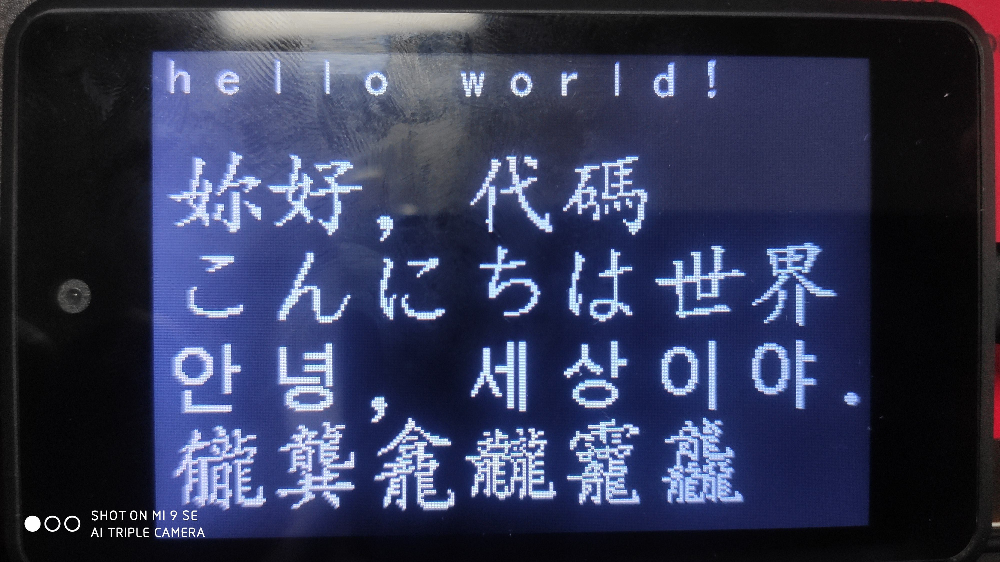
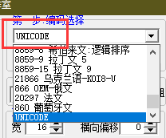
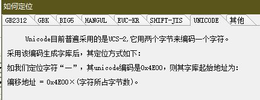
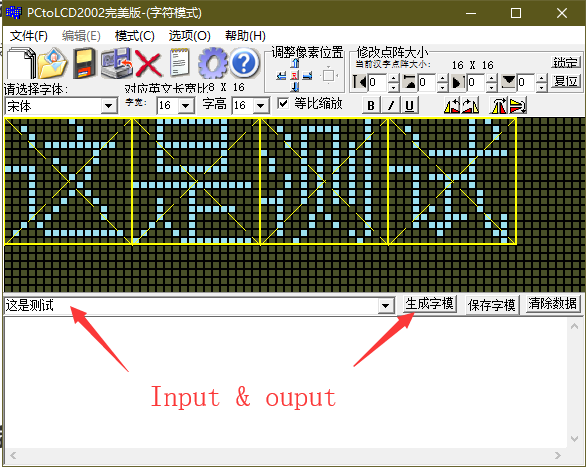
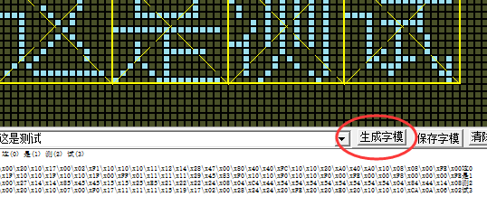
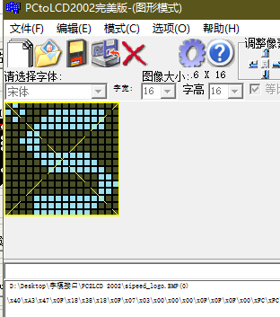

## 如何使用

该功能接口均使用 `image.Image()` 对象完成，MaixPy 固件请使用最新版本 2020年9月2日。

### 字模接口

使用 draw_font 打印字模字符串，类似 `img.draw_font(10, 20, 8, 8,  b'/x20/xFC/xFC/x2C/xAC/x4C/x4D/xA3')`。

```python
import lcd, image
lcd.init()
img = image.Image()
tmp = b'/x20/xFC/xFC/x2C/xAC/x4C/x4D/xA3'
img.draw_font(10, 20, 8, 8, tmp, scale=1, color=(255, 255, 255))
lcd.display(img)
```

范例参考 [image_draw_font.py](image_draw_font.py) 。

### 字库接口

请先使用 font_load / font_free 加载或释放字库，这将提升 draw_string 的功能，支持从  `xx.Dzk` 文件 与 Flash 地址加载，这之后后 draw_string 将通过字库打印字符串，目前只支持 `ASCII` / `UTF-8` 编码 。

> 附带字库文件 [0xA00000_font_uincode_16_16_tblr.Dzk](./tools/0xA00000_font_uincode_16_16_tblr.Dzk) 

```python
import lcd, image
lcd.init()
img = image.Image()
# image.font_load(image.UTF8, 16, 16, 0xA00000)
image.font_load(image.UTF8, 16, 16, '/sd/0xA00000_font_uincode_16_16_tblr.Dzk')
img.draw_string(20, 90, b'こんにちは、世界', x_spacing=2, mono_space=1)
image.font_free()
lcd.display(img)
```

范例参考 [image_draw_string.py](image_draw_string.py) 。

### 显示效果



### 字库工具

我们将使用根目录下的 [FontGenerator.zip](./tools/FontGenerator.zip) 导出字体对应的字库，请看下图完成导出操作。

1. 选择字库编码类型为 Unicode 编码，这将支持绝大多数国家的语言。

   

2. 选择扫描模式，为 5 横向、先上下后左右的字模的扫描打印方向。

   

3. 如下图配置所需要的字体样式后创建字库。

   

4. 保存成 DZK 格式即可，字模数据访问方法如图文字说明

   

### 字模工具

> 警告：不推荐使用字模工具，不了解的人请不要使用。

使用目录下的 [Pc2Lcd2002.zip](./tools/Pc2Lcd2002.zip)  获取字模的字符串。

1. 确认软件为字符模式。


2. 设置如图即可导出想要的字符串。

   ​	

3. 填入文字后点击生成字模。

   

4. 提取字模字符串即可使用。

   

```
 这(0) 是(1) 测(2) 试(3)

/x00/x20/x10/x17/x00/x02/xF1/x10/x10/x10/x11/x12/x14/x28/x47/x00/x80/x40/x40/xFC/x10/x10/x20/xA0/x40/xA0/x10/x08/x08/x00/xFE/x00这0
/x1F/x10/x10/x1F/x10/x10/x1F/x00/xFF/x01/x11/x11/x11/x29/x45/x83/xF0/x10/x10/xF0/x10/x10/xF0/x00/xFE/x00/x00/xF8/x00/x00/x00/xFE是1
/x00/x27/x14/x14/x85/x45/x45/x15/x15/x25/xE5/x21/x22/x22/x24/x08/x04/xC4/x44/x54/x54/x54/x54/x54/x54/x54/x54/x04/x84/x44/x14/x08测2
/x00/x20/x10/x10/x07/x00/xF0/x17/x11/x11/x11/x15/x19/x17/x02/x00/x28/x24/x24/x20/xFE/x20/x20/xE0/x20/x10/x10/x10/xCA/x0A/x06/x02试3
```

> 可以使用图形模式绘制自己喜欢的字模图形，支持 32 * 32 的图形。
>
> 